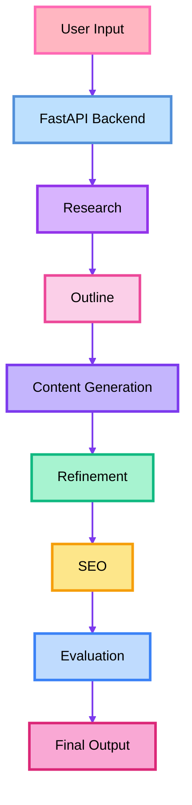

# 🚀 AI Content Generation Pipeline

<p align="center">


</p>

An AI-powered content generation platform that transforms a simple idea into high-quality, structured content using a multi-stage prompt engineering pipeline. The application generates professional content, refines it, provides SEO recommendations, and evaluates the final output—all through an intuitive web interface.

---

## 📌 Project Overview
This project was developed as part of an AI & Prompt Engineering Training Program. The objective was to build and develop an AI-powered content generation pipeline that creates high-quality, structured, and SEO-friendly content using prompt engineering.

---

## ✨ Features

- 📝 Generate multiple content types
  - Blog Posts
  - Articles
  - Product Descriptions
  - Social Media Posts
  - Emails

- 🎯 Multiple writing tones
  - Professional
  - Casual
  - Friendly
  - Persuasive
  - Formal

- ⚡ Multi-stage AI pipeline
  - Research Generation
  - Content Outline
  - Draft Generation
  - Content Refinement
  - SEO Suggestions
  - Quality Evaluation

- 📊 AI-powered content evaluation
  - Grammar Score
  - Readability Score
  - Professionalism Score
  - SEO Score
  - Originality Score
  - Overall Quality Score

- 🎨 Modern responsive UI

- 🔄 Real-time AI content generation

---

## 🛠 Tech Stack

### Frontend
- HTML5, CSS3, JavaScript

### Backend
- FastAPI, Python

### AI
- Groq API, **Model** - Llama 3.3 70B Versatile

---

## 🚀 Installation

### Clone the repository

```bash
git clone https://github.com/Stars8575/PROJECT3-ContentGenerationPipeline.git
```

```bash
cd PROJECT3-ContentGenerationPipeline
```

---

### Create a virtual environment

Windows

```bash
python -m venv venv
```

Activate

```bash
venv\Scripts\activate
```

---

### Install dependencies

```bash
pip install -r backend/requirements.txt
```

---

### Configure Environment Variables

Create a `.env` file inside the **backend** folder.

```env
GROQ_API_KEY=YOUR_GROQ_API_KEY
```

---

### Start the Backend

```bash
cd backend
uvicorn app:app --reload
```

Server runs at

```
http://127.0.0.1:8000
```

---

### Open the Frontend

Simply open

```
frontend/index.html
```

or run it using Live Server in VS Code.

---

## 📷 Application Workflow



---

## 👩‍💻 Author

**Anushka Tuli**
GitHub: https://github.com/Stars8575
